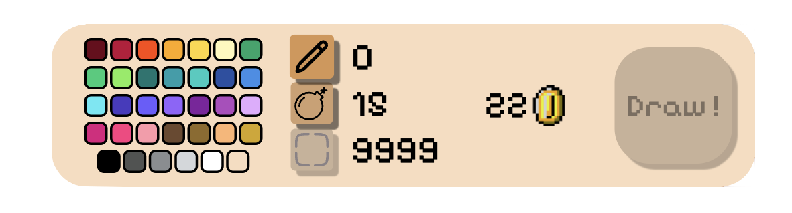

<div align="center">
	
</div>

<h1 align="center">
	Link
</h1>
<p align="center">
	https://rplace.transcendons.fr/
</p>


## Description
<p align="center">
	Like the original r/Place, just come put your pixels !
</p>

## Local installation

- Step 1 : Install and run Docker [Documentation](https://docs.docker.com/engine/install/)

- Step 2 : Clone project and rename the 3 ".env-example" files by ".env". Variables are already filled, but it is recommanded to replace them with your own values.

- Step 3 : On terminal, go to project folder and put :
```bash
docker compose up --build
```

After building, your app is running on the URL indicated in front .env file. (localhost:4173 by default)

## How it works

<div align="center">
	
</div>
<p align="center">
	After creating your account, click on every pixel to colore them. All pixels drawn will earn you 1 coin. Call your friends to create your most beautiful works together !
</p>

## Shop

<div align="center">
	
</div>
<p align="center">
	With coins, you can buy bonuses in the shop.
</p>

- Pen : Free. It just fills a pixel and earn you 1 coin.
- Bomb : 15 coins. It explodes on the selected pixel and fills a large zone around it.
- Screen: 9999 coins ..? I'll let you discover its effect :)

### Comming soon

- Diamond hand : 30 coins. Upon purchase, every pixel drawn will earn you 2 coins for 5 minutes.
- Fast pen : 30 coins. Upon purchase, the cooldown between 2 draws is divided by 5 for 1 minute.
- Super pen : 3 coins. Its range is 3 times better than the pen, so it can draw 9 pixels at time.
- Super bomb : 45 coins. Like the bomb, but in super version.
- Secure pixel : 100 coins. The drawn pixel cannot be changed for 15 mins, except by Screen.
- Timeless pixel : 500 coins. The drawn pixel cannot be changed for 60 mins. Even with the Screen.
